# CHERIE DAY — Production Lab Index

**Sprint date:** 2026-07-07 (last day of Higgsfield subscription)
**Tool used:** Higgsfield via the Claude MCP connector — models `soul_2` (text2image_soul_v2, 2K) and `nano_banana_pro` (nano_banana_2, 1K, used for 2 premium hero frames).
**Replicate:** no API key available in the environment — not used.
**Full prompts + job IDs:** [job-manifest.json](job-manifest.json) (every image's exact prompt, model, aspect ratio, Higgsfield job ID for re-download/upscale).
**Totals:** 42 image files (37 sprint + 3 replacements + 2 4K upscales) · 39 kept · 3 rejected · ~12.6 credits spent · 1.36 credits remaining at end of sprint.
**4K masters:** F1 and F2 were upscaled to 4096×2294 before the subscription lapse — use `F1-hero-full-nanobanana-4K.png` / `F2-hero-intimate-nanobanana-4K.png` as the production sources.

Ratings: ★★★★★ hero-grade · ★★★★ strong · ★★★ usable with notes · ✕ rejected (kept in `09-rejected/`).

---

## 01 — Style Directions (16:9)

| Preview | File | Direction | Rating | Notes |
|---|---|---|---|---|
| 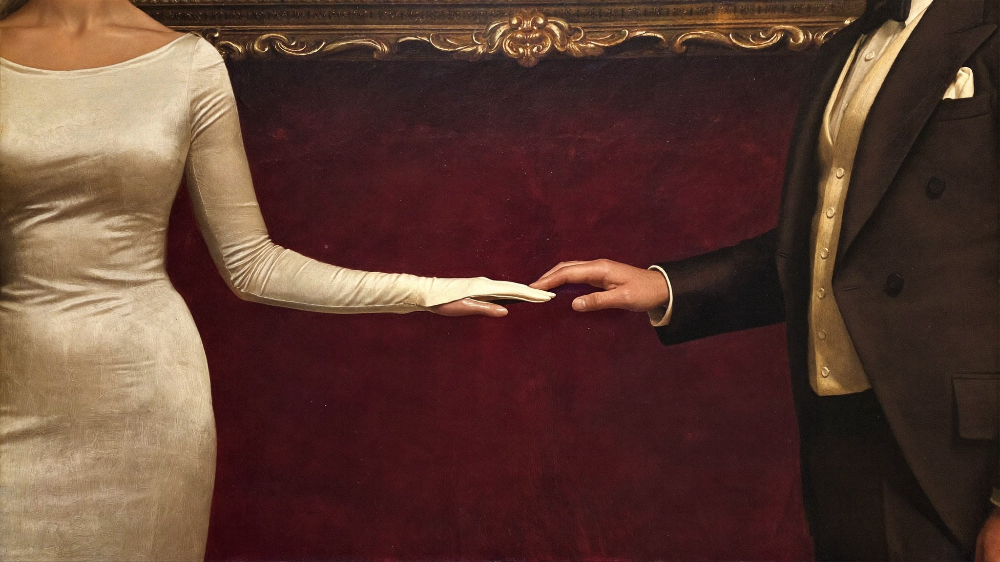 | A1-classical-luxury-painting.png | Turkish-European classical luxury painting | ★★★★★ | Burgundy velvet wall + gilt frame, anonymous crop (heads out of frame) reads intentional and editorial. Strongest classical direction. |
| 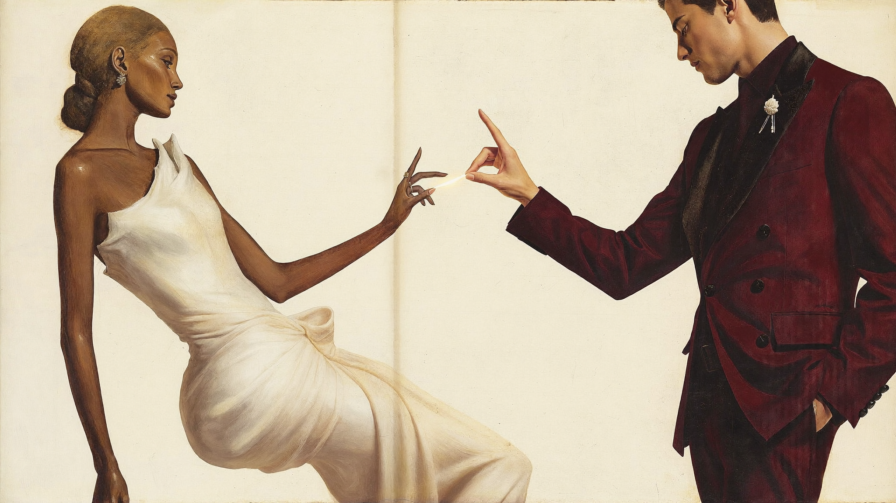 | A2-vogue-editorial-painting.png | Vogue-like modern bridal editorial painting | ★★★★ | Striking illustrated-fashion energy, burgundy velvet suit, near-touch fingertip with light. Bride's reclining pose is stylized/floating. |
| 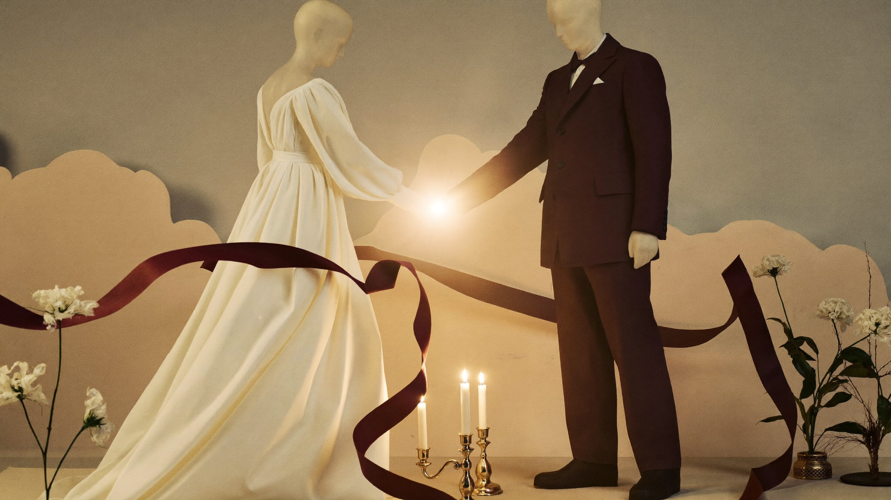 | A3-paper-atelier-world.png | Soft cinematic paper/atelier world | ★★★ | Paper-stage diorama with ribbon + candles is exactly the 2.5D world; faceless mannequin heads may read eerie — treat as a set-design reference, not a figure reference. |

**Verdict:** A1 (classical) is the strongest overall mood; A3 supplies the stage/layer logic the WebGL lab needs; A2 is the typography-friendly negative-space option.

## 02 — Bride/Groom Cutout References (3:4, ivory bg)

| Preview | File | Rating | Notes |
|---|---|---|---|
| 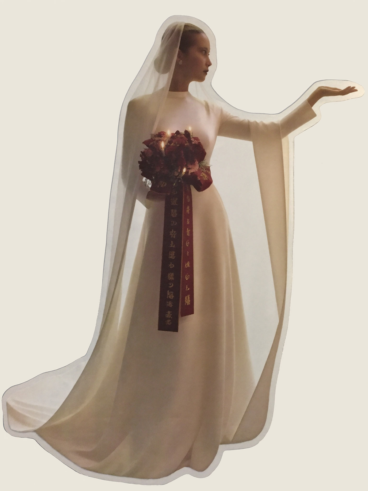 | B1-bride-full-figure.png | ★★★ | Beautiful figure, literal sticker-cutout edge (great for 2.5D). FLAW: bouquet ribbons carry pseudo-calligraphy glyphs — retouch or crop before use. |
| 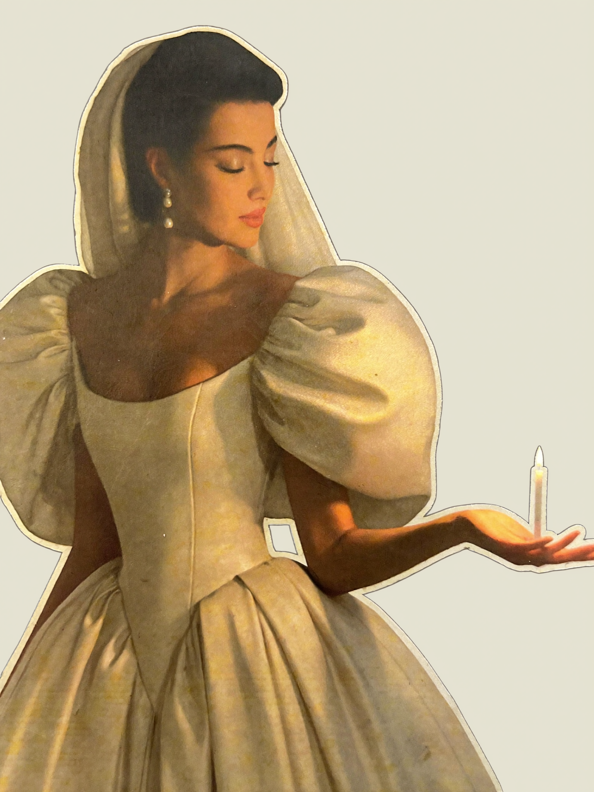 | B2-bride-half-figure.png | ★★★ | Painterly and warm, holds a candle flame; puff sleeves read 1980s-vintage rather than modern couture. |
|  | B3-groom-full-figure.png | ★★★★ | Clean full-figure velvet-suit groom on flat ivory, open reaching hand, easy cutout. Slightly vintage frock-coat length. |
| 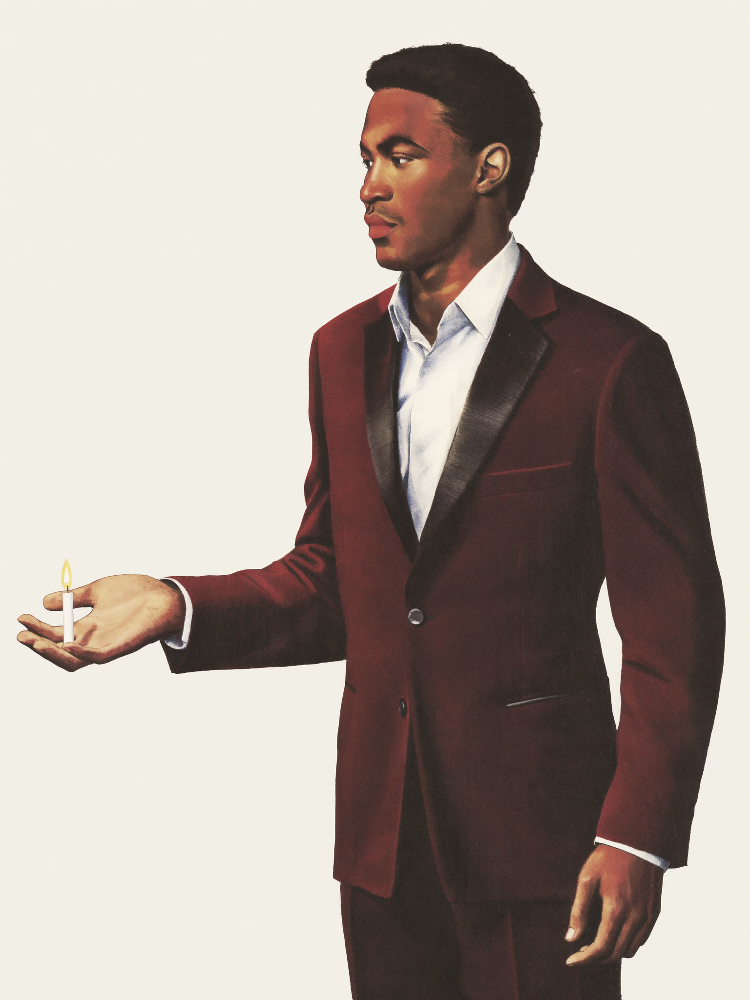 | B4-groom-half-figure.png | ★★★★★ | Excellent modern burgundy velvet tux, candle-on-palm gesture, flat ivory bg — best character cutout of the set. |

## 03 — Hand/Finger Close-ups (16:9)

| Preview | File | Rating | Notes |
|---|---|---|---|
| 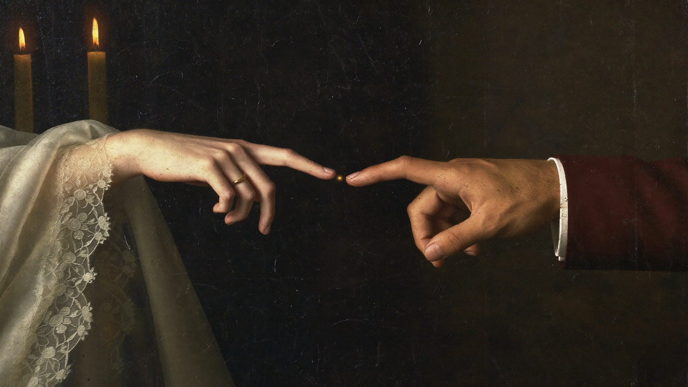 | C1-creation-near-touch.png | ★★★★★ | Candlelit Creation-of-Adam near-touch, flawless anatomy, lace + burgundy cuff. Hero-grade. |
| 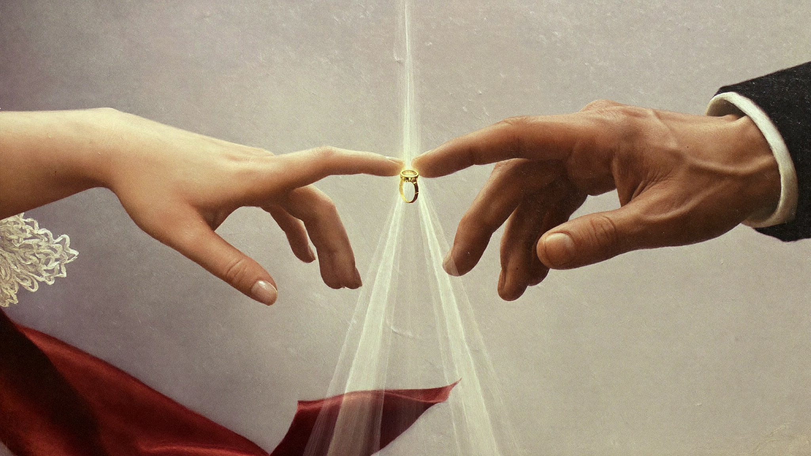 | C2-ring-between-fingertips.png | ★★★★ | Gold ring suspended between fingertips with light rays; clean anatomy; slightly more photographic finish. |
| 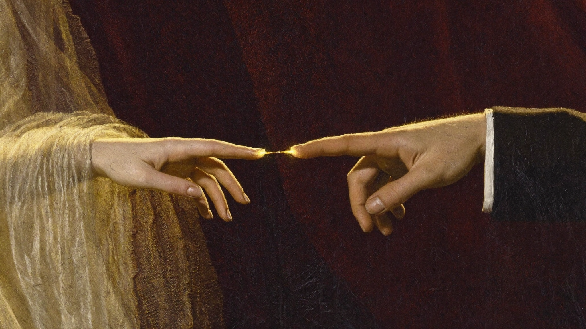 | C3-light-thread-touch.png | ★★★★★ | Luminous thread between fingertips, veil trailing, burgundy velvet dark — the near-touch promise in one frame. |
| 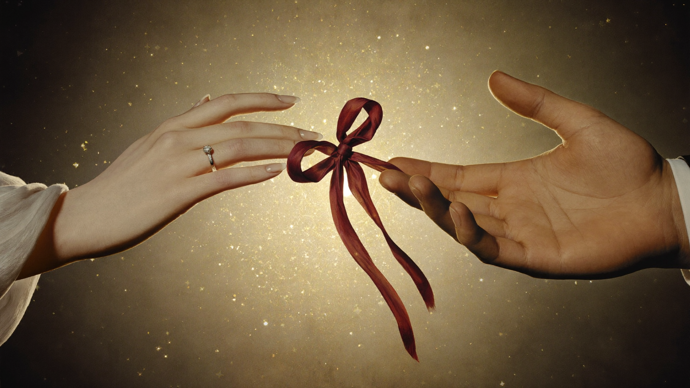 | C4-red-thread-promise.png | ★★★★ | Red-thread bow linking hands, engagement ring, golden dust field. |

All four passed the hand-anatomy check (five fingers, no distortion, no plastic nails).

## 04 — Maison Objects (1:1, isolated)

| Preview | File | Rating | Notes |
|---|---|---|---|
|  | D1-invitation-envelope-v2.png | ★★★★★ | Replacement — blank blind-embossed card + burgundy-lined envelope, zero lettering. |
|  | D2-wax-seal.png | ★★★★★ | Burgundy wax seal, monogram + laurel relief, tactile and clean. |
|  | D3-silk-ribbon-brass.png | ★★★★★ | Flowing burgundy silk through a brushed brass band — signature object. |
|  | D4-gift-box.png | ★★★★ | Ivory box, burgundy bow, glowing lid gap ("objects born from light" motif). |
|  | D5-soz-nisan-tray.png | ★★★ | Correct söz/nişan iconography (tray, cups, ring cushion, petals) but finish is photographic rather than painterly. |
| 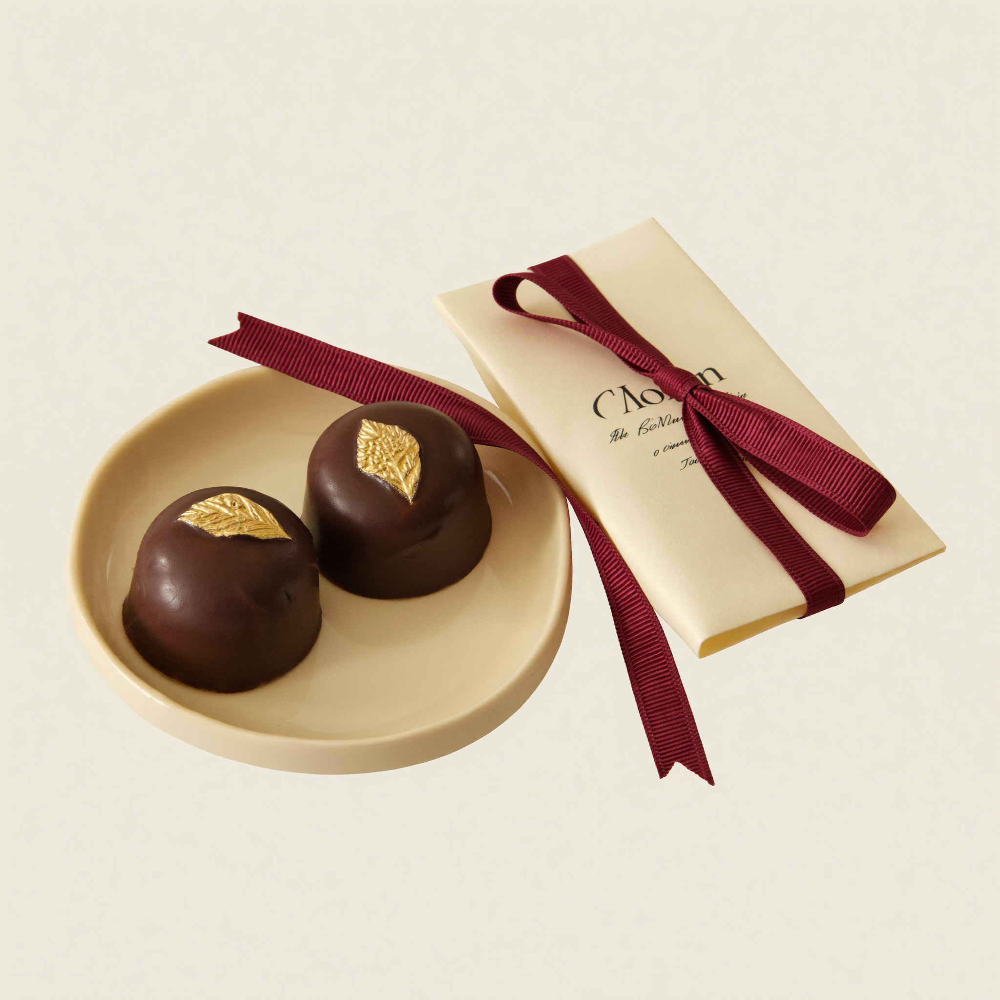 | D6-chocolate-favor-v2.png | ★★★ | Replacement — gold-leaf bonbons on ivory dish; faint pseudo-script on the paper wrapper needs retouch. |
|  | D7-qr-invitation-card.png | ★★★★ | Abstract brass QR-medallion concept with wax seal — exactly the "QR without a QR" idea; two tiny stray glyphs at left edge. |
|  | D8-album.png | ★★★★ | Linen album, burgundy leather spine, brass corners + medallion. |
| 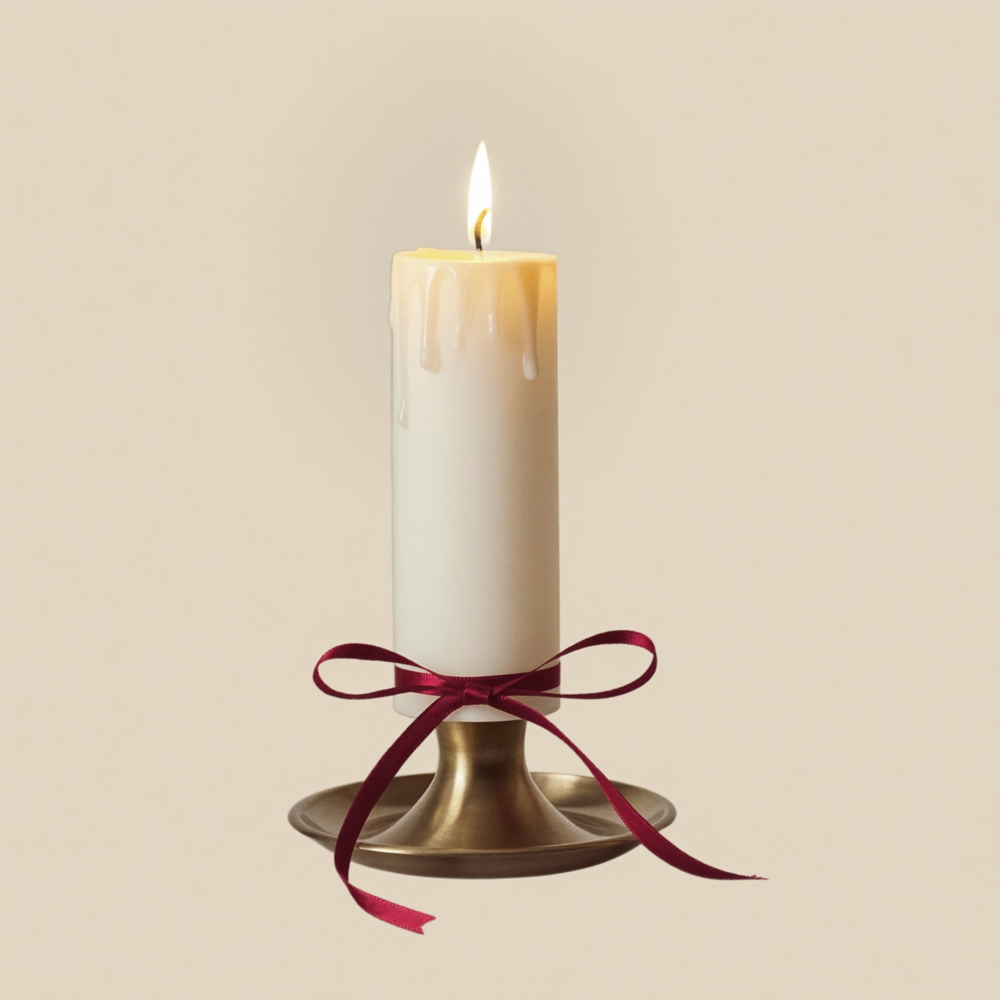 | D9-candle.png | ★★★★★ | Ivory pillar candle, brass holder, burgundy ribbon — clean icon-grade object. |

## 05 — Background / Stage Layers (16:9)

| Preview | File | Rating | Notes |
|---|---|---|---|
| 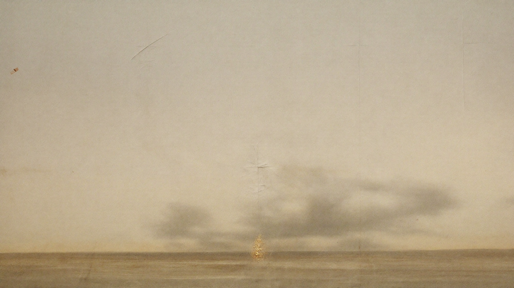 | E1-ivory-paper-sky.png | ★★★★ | Ivory painted-paper sky; tiny artifact at horizon center — one-minute heal-brush fix. |
| 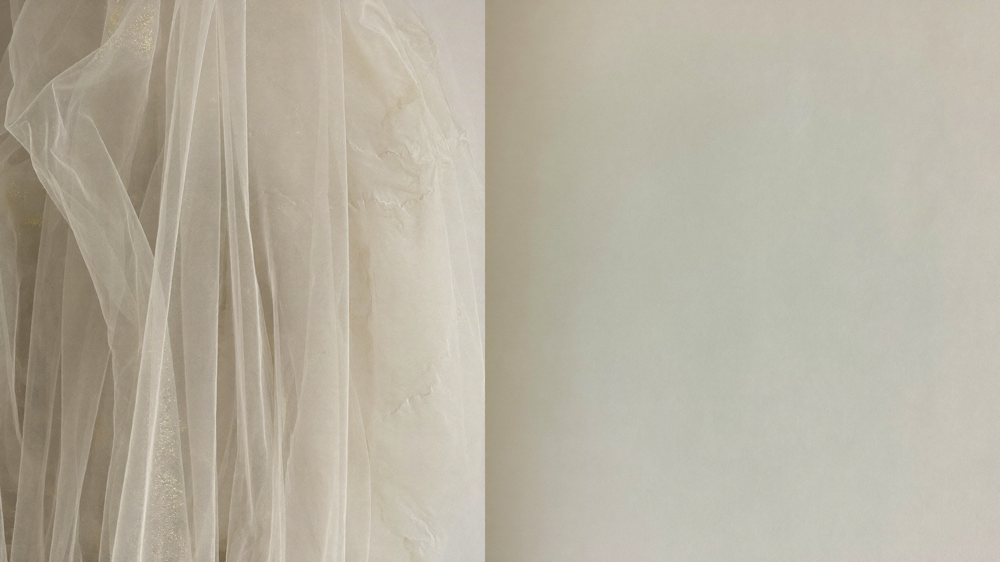 | E2-veil-aura-left.png | ★★★ | Real tulle folds on the left; hard vertical seam mid-frame — use left half as the layer source. |
| 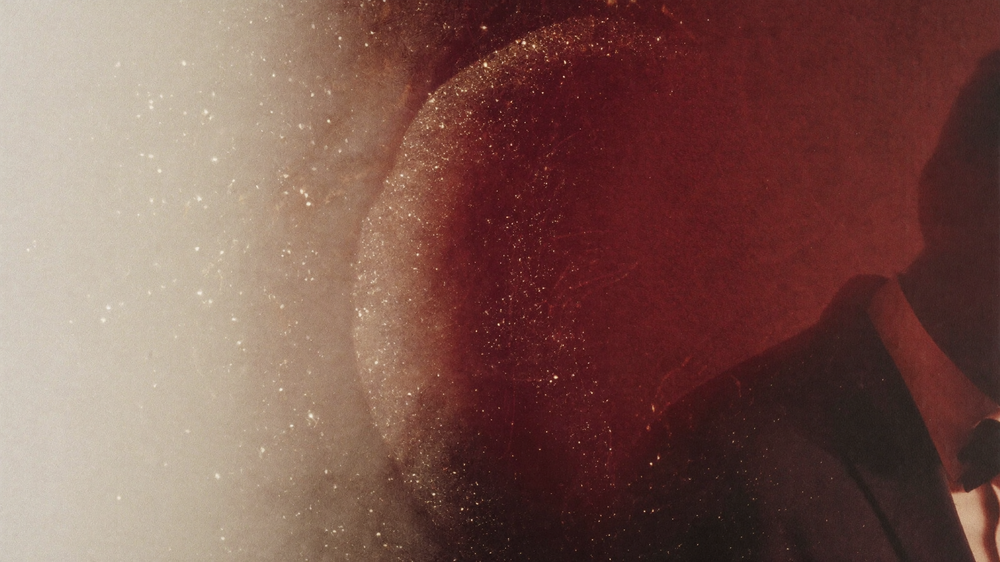 | E3-groom-shadow-aura-right.png | ★★★★ | Burgundy shadow aura with brass dust; faint suit-shoulder intrusion bottom-right — crop right edge. |
| 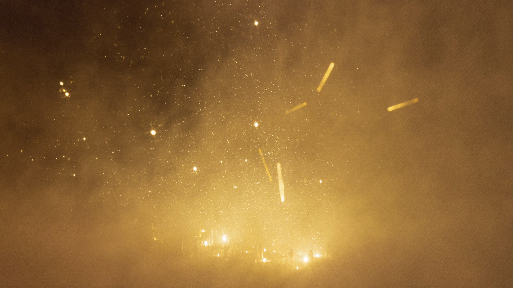 | E4-candlelit-brass-haze.png | ★★★★★ | Brass haze + embers + bokeh — drop-in additive light layer for the WebGL scene. |
| 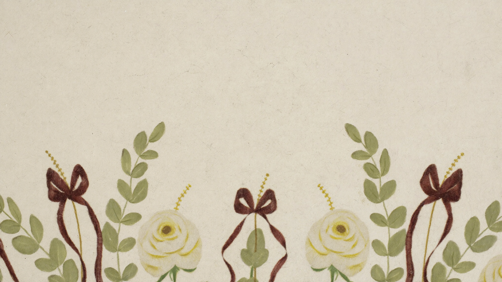 | E5-floral-foreground.png | ★★★★ | Painted roses/foliage/ribbon bottom border on paper — foreground vignette layer. |

## 06 — Hero Poster Frames (16:9)

| Preview | File | Rating | Notes |
|---|---|---|---|
| 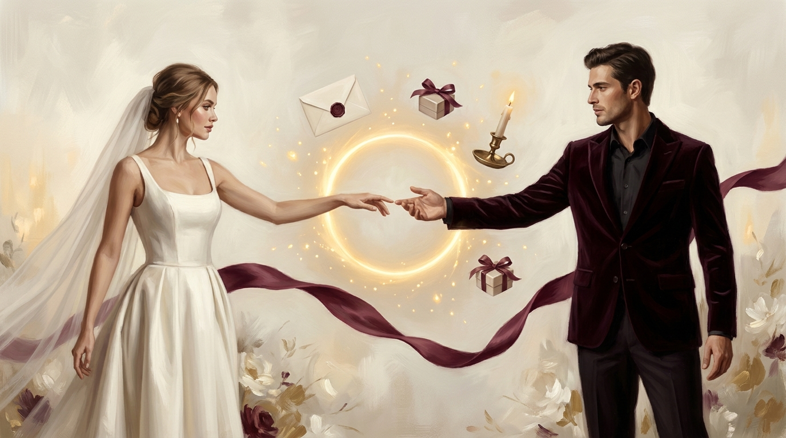 | F1-hero-full-nanobanana.png | ★★★★★ | nano_banana_pro. The full brief in one frame: bride left / groom right, ring of light, ribbon arc, floating maison objects. Primary hero reference. |
| 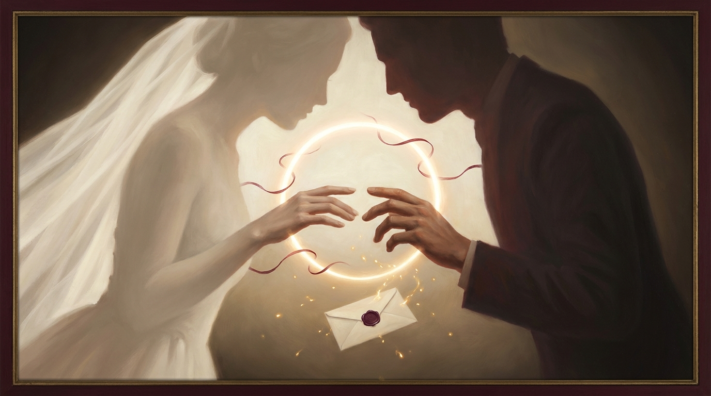 | F2-hero-intimate-nanobanana.png | ★★★★★ | nano_banana_pro. Silhouettes + detailed hands over the ring, wax-sealed envelope born from light. Has a painted gold frame border — crop. |
| 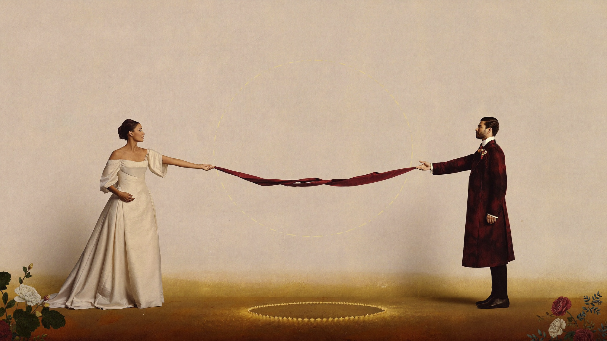 | F3-hero-wide-theatrical-v2.png | ★★★★ | Replacement — both figures facing inward, ribbon spanning the ivory void, glowing circle on the ground, floral corners. |
| 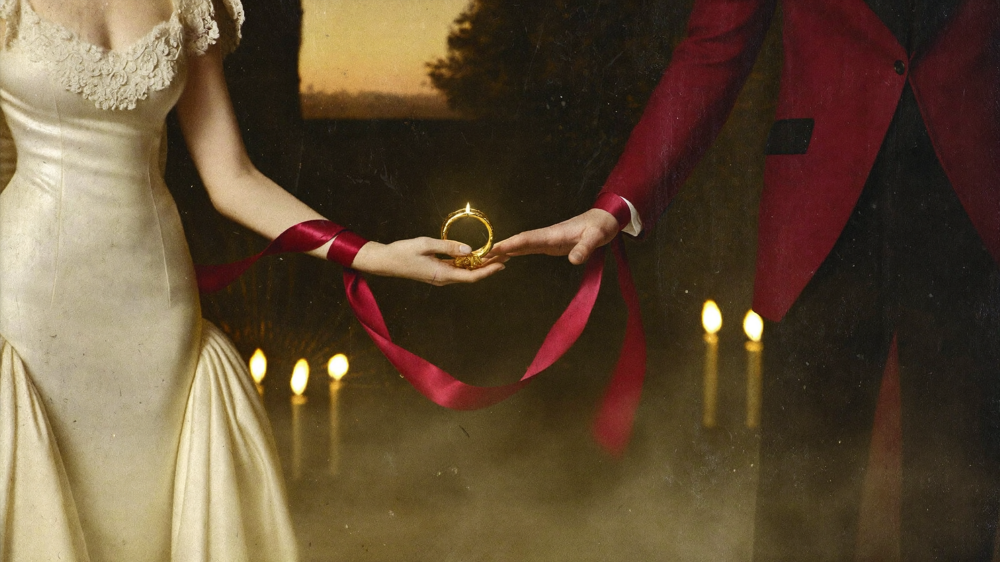 | F4-hero-dusk-variant.png | ★★★★ | Dark dusk mood: ribbon binding both wrists around the ring, candle rows. Headless waist-level crop = detail-shot reference. |

## 07 — Mobile Fallback Posters (9:16)

| Preview | File | Rating | Notes |
|---|---|---|---|
| 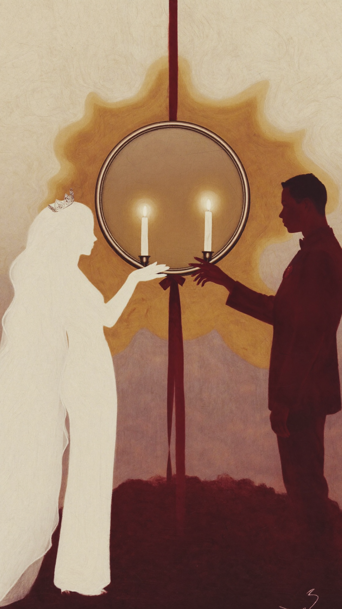 | G1-mobile-central-ring.png | ★★★ | Strong silhouette poster, central ring with candles; small signature-like squiggle bottom-right — retouch. |
| 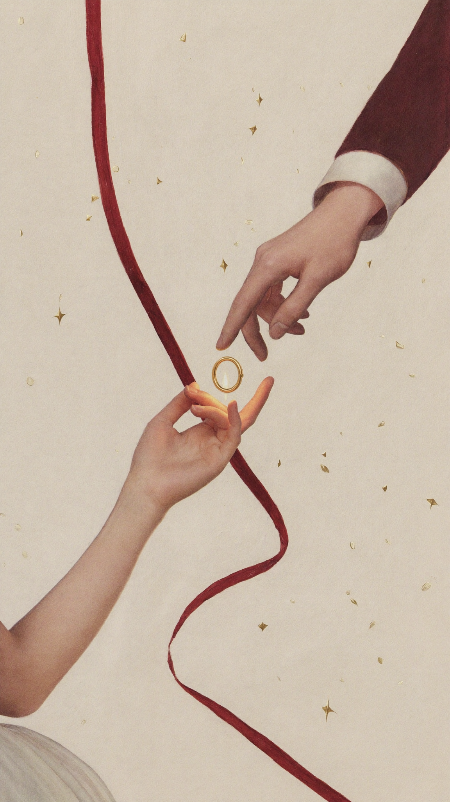 | G2-mobile-hands-close.png | ★★★★★ | Hands + ring + red ribbon on ivory paper — the best mobile fallback, instantly readable at phone size. |
| 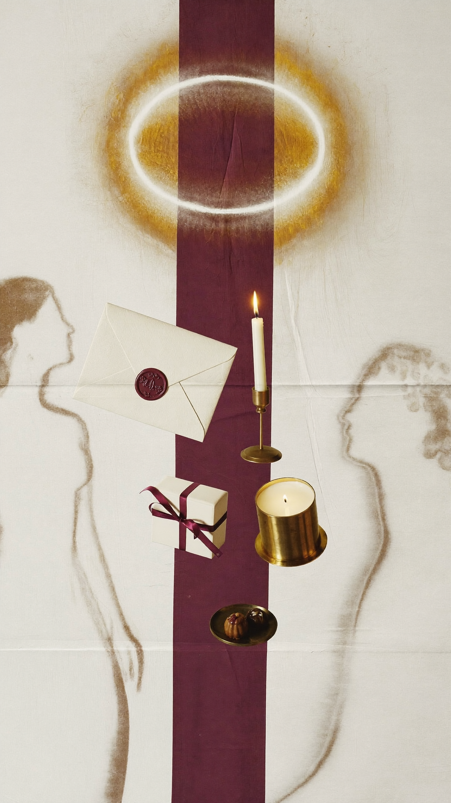 | G3-mobile-object-ribbon.png | ★★★★ | Halo + burgundy ribbon column with objects cascading, sketched bride/groom presences at the edges. |

## 08 — Textures (1:1)

| Preview | File | Rating | Notes |
|---|---|---|---|
|  | H1-ivory-paper.png | ★★★★ | Subtle handmade ivory paper grain. |
|  | H2-burgundy-silk.png | ★★★★★ | Deep burgundy silk with soft folds. |
|  | H3-wax-seal-surface.png | ★★★★★ | Macro wax relief surface — displacement/normal-map source. |
|  | H4-brushed-brass.png | ★★★★★ | Brushed antique brass — material reference for WebGL brass shader. |
|  | H5-veil-tulle.png | ★★★★ | Backlit tulle folds; more drape than mesh-weave macro. |

## 09 — Rejected (kept for reference)

| File | Reason |
|---|---|
| D1-invitation-envelope--gibberish-text.png | Prominent gibberish fake calligraphy ("Caulietre Wedhina…") despite no-text prompt. Replaced by D1-v2. |
| D6-chocolate-favor--flame-on-chocolate.png | Concept confusion: lit flame growing out of the chocolate. Replaced by D6-v2. |
| F3-hero-wide-theatrical--groom-walking-away.png | Composition failure: groom walking *away* from the bride, ribbon reads as tug-of-war rope. Replaced by F3-v2. |

### Rejected / recurring failure patterns observed
1. **Fake lettering on stationery** — soul_2 adds pseudo-calligraphy to any card, ribbon or wrapper unless the prompt says "completely blank / blind-embossed only" (D1, B1 ribbons, D6-v2 wrapper, D7 edge glyphs).
2. **Directional misreads** — "walking inward" was rendered as walking through/away (F3 v1). Explicit "FACING RIGHT / FACING LEFT toward each other" fixed it.
3. **Photographic drift on still-lifes** — object prompts drift from painterly to product-photo finish (D5, D4). Acceptable for geometry/material reference.
4. **Prop hallucination** — candles/flames appear unprompted (B2, B4 palms, bouquet in B1, D6 v1). Harmless in figures, wrong on food.
5. **Frame/signature artifacts** — painted gold frame border (F2), signature squiggle (G1) — croppable.

Notably absent: no extra fingers, no plastic skin, no Ottoman/mosque/bazaar clichés, no cartoon, no childish hearts in any output.

---

## Best 5 of the sprint
1. **C1-creation-near-touch** — the near-touch promise, hero-grade classical hands.
2. **F1-hero-full-nanobanana** — the complete hero-poster brief in one frame.
3. **C3-light-thread-touch** — light thread between fingertips, veil + burgundy velvet.
4. **F2-hero-intimate-nanobanana** — silhouettes + ring of light + envelope born from light.
5. **G2-mobile-hands-close** — strongest vertical/mobile fallback.

## Recommended next step (WebGL lab integration — LATER, not now)
- Treat `05-backgrounds` as the literal layer stack for the 2.5D stage: E1 (base sky) → E3 (right shadow aura) → E4 (additive brass haze) → cutout figures (B4 + B1 after ribbon retouch) → hands plate (C1/C3) → E5 (foreground florals) → E2-left-half (veil overlay).
- Use H1–H5 as material/shader references (H3 doubles as a bump/displacement source, H4 for the brass ring material).
- Background-remove B1/B3/B4 (Higgsfield `remove_background` or local) to produce true transparent cutouts before any WebGL work.
- ~~Upscale the chosen finals to 4K~~ **Done during the sprint**: F1 and F2 4K masters are saved. Remaining balance (1.36 credits) is below the 2-credit upscale cost, so no further upscales are possible.
- Keep F1 as the compositional target the WebGL scene should converge to; G2 is the `<video>`/WebGL mobile poster fallback.
- No homepage or `app/(site)/page.tsx` changes were made; nothing is wired into code yet.
